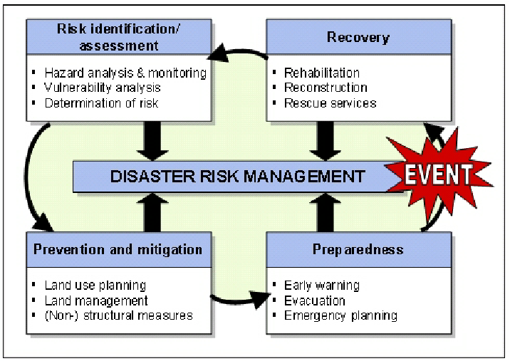
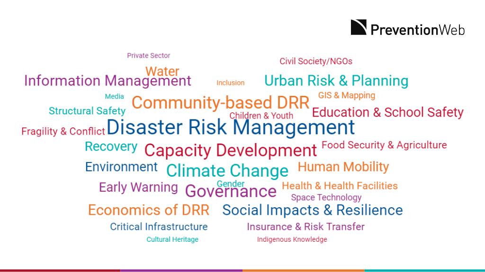
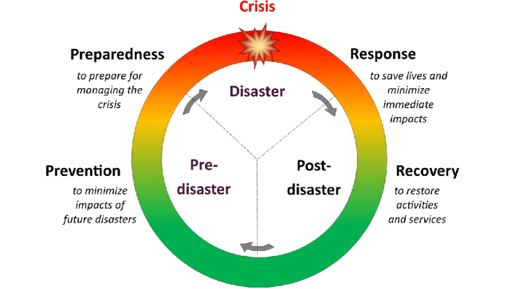
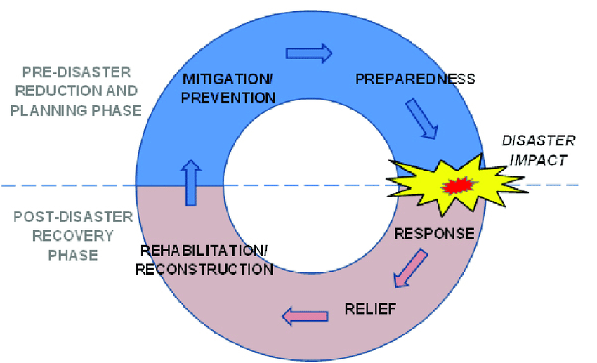
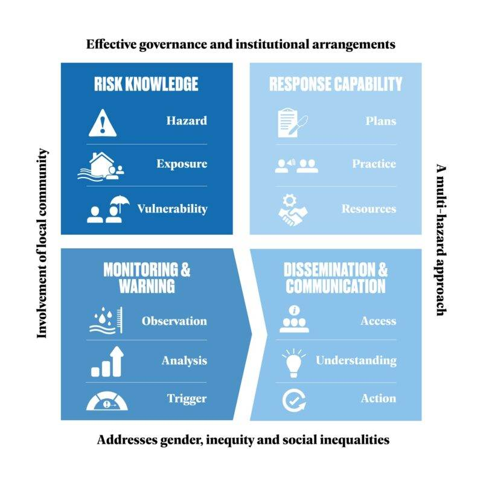

# Disaster Risk Management (DRM) Framework — Study Guide

---

## 1. Definition of Disaster Risk Management

The term **United Nations Office for Disaster Risk Reduction (UNDRR)** defines **disaster risk management (DRM)** as:

> “The application of disaster risk reduction policies and strategies to prevent new disaster risk, reduce existing disaster risk and manage residual risk, contributing to the strengthening of resilience and reduction of disaster losses.” — [UNDRR][1]

This definition highlights three key tasks:

- Preventing new disaster risk (avoid creating risk)
- Reducing existing disaster risk (mitigate what already exists)
- Managing residual risk (what cannot be eliminated — preparedness, response, recovery)

In essence, DRM is a **systematic, continuous process** of understanding hazards and vulnerabilities, reducing risk where possible, and managing impacts when hazards materialize.  
In the Indian context, framed under the **Disaster Management Act, 2005**, DRM covers prevention, mitigation, preparedness, response, relief, rehabilitation and reconstruction. — [Press Information Bureau][2]

---

## 2. Difference between DRM and Disaster Risk Reduction (DRR)

| Concept | Scope | Focus | Example |
|----------|--------|--------|----------|
| **DRR** | Subset of DRM | Risk prevention and mitigation | Building codes, land-use planning |
| **DRM** | Broader framework | Full disaster management cycle | Early warnings, recovery, resilience |

**Key distinction:**

- **DRR** = *Risk-reduction oriented* (Prevention + Mitigation)
- **DRM** = *Full cycle oriented* (Prevention + Mitigation + Preparedness + Response + Recovery + Resilience)

Analogy:  
DRR is like building a strong dam; DRM is building it, monitoring floods, evacuating people, and rebuilding after a flood.

---

## 3. Core Elements of Disaster Risk Management

### 3.1 Risk Identification and Assessment

- Understanding hazards, exposure, vulnerability, and capacity.  
- Formula: **Risk = Hazard × Exposure × Vulnerability** — [PreventionWeb][3]  
- *Example:* Landslide-risk mapping in Himalayan states.

### 3.2 Prevention and Mitigation

- **Prevention:** Avoid creating new risks (e.g., no-build zones in flood plains).  
- **Mitigation:** Reduce existing risks (e.g., retrofitting schools for earthquakes).  
- *Example:* Retrofitting Chennai’s storm-water drains. — [UNDRR][1]

### 3.3 Preparedness

- Institutional readiness, drills, stockpiles, evacuation plans.  
- *Example:* NDRF conducts mock drills in flood-prone districts. — [Press Information Bureau][2]

### 3.4 Response

- Immediate actions: rescue, relief, evacuation, medical aid.  
- *Example:* Kerala Floods (2018): large-scale coordinated evacuation.

### 3.5 Recovery and Reconstruction

- Post-disaster restoration and “Build Back Better”.  
- *Example:* Bhuj Earthquake (2001): seismic-resilient rebuilding. — [UNDRR][6]

### 3.6 Governance, Institutions & Financing

- NDMA → SDMA → DDMA structure in India.  
- Financial mechanisms like disaster mitigation funds. — [ili.ac.in][8]

### 3.7 Monitoring, Learning & Improvement

- Evaluate performance, learn lessons, revise plans.  
- *Example:* Updating evacuation routes post-cyclone. — [UNDRR][9]

---

## 4. Resilience in DRM Context

**Resilience** is the capacity to absorb, adapt, and recover from hazards efficiently.

- Resilience = outcome of effective DRM.
- *Example:* Odisha’s coastal villages with cyclone shelters and drills.
- Emphasized in the **Sendai Framework 2015-2030**. — [UNDRR][10]

---

## 5. Recovery Processes

**Phases of Recovery:**

1. **Short-term:** Relief, critical services, temporary shelters.  
2. **Medium-term:** Rebuild infrastructure, restore livelihoods.  
3. **Long-term:** Build back better — hazard-resistant reconstruction.  
   *Example:* Post-2004 Tsunami — Kerala & Tamil Nadu coastal redesign. — [UNDRR][6]

---

## 6. Early Warning Systems (EWS)

> “An integrated system of hazard monitoring, forecasting, risk assessment, communication and preparedness enabling timely action.” — [UNDRR][11]

**Core Components:**

- Hazard detection & monitoring  
- Risk assessment  
- Forecasting and prediction  
- Communication and dissemination  
- Community preparedness  

*Example:* IMD cyclone alerts and Odisha evacuation protocols.

---

## 7. Important Measures for Disaster Risk Reduction (DRR)

- Enforce **hazard-resistant building codes**
- Regulate **land-use** in flood plains & slopes
- Promote **ecosystem-based approaches** (mangroves, wetlands)
- Retrofit schools, hospitals, and bridges
- Develop **multi-hazard mapping**
- Conduct **public awareness campaigns**
- Build **early-warning & community alert systems**
- Support **community-based DRM**
- Establish **insurance and contingency funds**
- Integrate DRR into **development and climate policies**
- Promote **monitoring and continuous learning**

---

## 8. DRM Framework Diagram / Flowchart

**Text-based flow representation:**
Risk Identification & Assessment
↓
Prevention & Mitigation
↓
Preparedness (includes Early Warning)
↓
Response
↓
Recovery & Reconstruction
↓
Monitoring & Learning → feeds back to Risk Identification

**Enablers (throughout the cycle):**  
Governance | Financing | Institutions | Community Participation | Resilience Building

---

## 9. Case Studies from India

### Case Study 1: Cyclone Phailin (2013) — Odisha

- Timely early warnings and mass evacuation.
- Use of cyclone shelters reduced loss of life drastically.
- Showcases **effective preparedness + resilience**.

### Case Study 2: Uttarakhand Flash-Floods (2013)

- Weak land-use and slope regulation worsened impacts.  
- Illustrates **policy-implementation gap**. — [ScienceDirect][14]

### Case Study 3: Chennai Urban Floods (2015)

- Overburdened drainage system caused urban flooding.  
- Post-disaster reforms: mapping, drainage improvement, no-build zones.

---

## 10. Connecting Theory to Practice

- **DRM framework** = *What and Why*  
- **Implementation** = *How* (institutional, financial, participatory)
- India’s NDMA–SDMA–DDMA network operationalizes DRM. — [ndma.gov.in][15]
- Financing via **National Disaster Mitigation Fund** supports DRR.
- Grassroots DRM via community mapping and local drills ensures sustainability.
- **Risk-informed development** integrates hazard knowledge into every project.

---

## Conclusion

The **Disaster Risk Management Framework** is the core theoretical and practical foundation for understanding disaster governance.

**Key Takeaways:**

- Differentiate DRM and DRR clearly.
- Master each core element with Indian examples.
- Highlight resilience and recovery as interconnected outcomes.
- Emphasize early warning as the bridge between preparedness and response.
- Reference NDMA, Sendai Framework, and Indian case studies.

---

## References

[1]: https://www.undrr.org/terminology/disaster-risk-management  
[2]: https://www.pib.gov.in/PressNoteDetails.aspx?ModuleId=3&NoteId=155004  
[3]: https://www.preventionweb.net/understanding-disaster-risk/components-risk  
[4]: https://www.unisdr.org/files/52828_nationaldisasterriskassessmentpart1.pdf  
[5]: https://www.undrr.org/terminology/preparedness  
[6]: https://www.undrr.org/implementing-sendai-framework/what-sendai-framework  
[7]: https://medium.com/%40a.sandeep146/the-institutional-framework-for-disaster-management-in-india-from-response-to-resilience-cfc6d7a0d944  
[8]: https://ili.ac.in/pdf/p13_rajendra.pdf  
[9]: https://www.undrr.org/building-risk-knowledge/understanding-risk  
[10]: https://www.undrr.org/publication/sendai-framework-disaster-risk-reduction-2015-2030  
[11]: https://www.undrr.org/terminology/early-warning-system  
[12]: https://www.undrr.org/publication/disaster-risk-reduction-strategies-and-risk-management-practices-critical-elements  
[13]: https://www.undrr.org/implementing-sendai-framework/drr-focus-areas/climate-action-and-disaster-risk-reduction  
[14]: https://www.sciencedirect.com/science/article/pii/S2212420921003897  
[15]: https://ndma.gov.in/sites/default/files/PDF/Sikkim_Conclave/Session%202/1%20z%20NDMA%20Disaster%20Management%20PPT%20by%20JS%20%28PP%29%20-%20Revised.pdf

